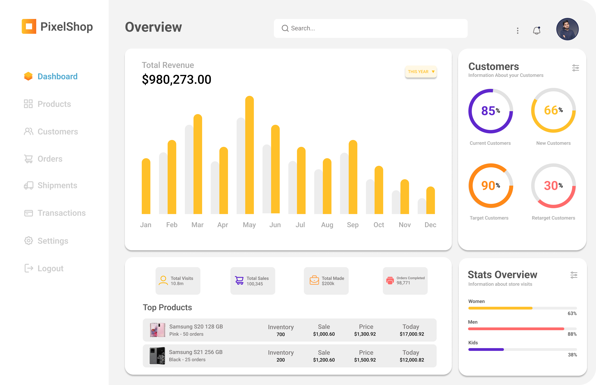
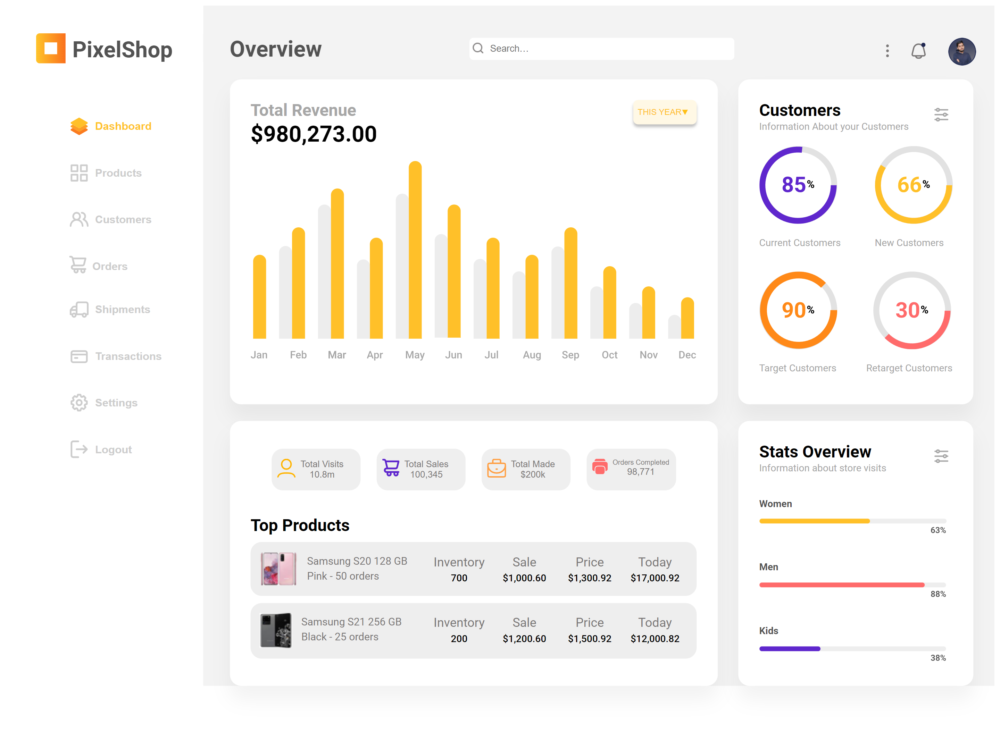
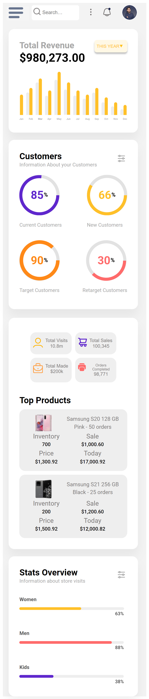
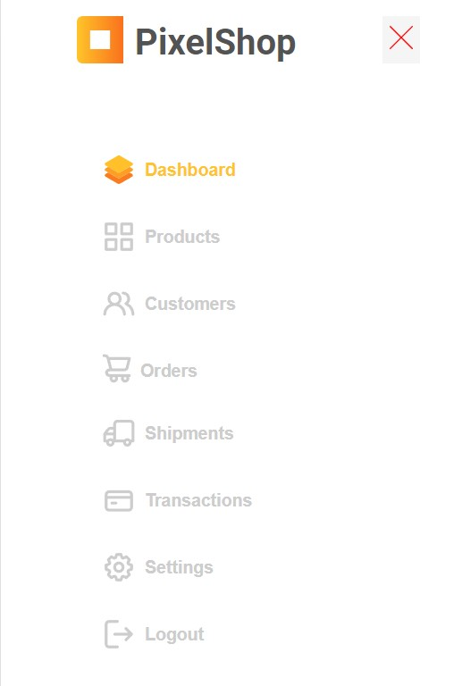

<p align = center>МИНИСТЕРСТВО НАУКИ И ВЫСШЕГО ОБРАЗОВАНИЯ

<p align = center>РОССИЙСКОЙ ФЕДЕРАЦИИ

<p align = center>ФЕДЕРАЛЬНОЕ ГОСУДАРСТВЕННОЕ БЮДЖЕТНОЕ ОБРАЗОВАТЕЛЬНОЕ УЧРЕЖДЕНИЕ ВЫСШЕГО ОБРАЗОВАНИЯ

<p align = center>«ВЯТСКИЙ ГОСУДАРСТВЕННЫЙ УНИВЕРСИТЕТ»

<p align = center>Институт математики и информационных систем

<p align = center>Факультет автоматики и вычислительной техники

<p align = center>Кафедра систем автоматизации управления
<br>
<br>
<br>
<br>

<p align = right>Дата сдачи на проверку:

<p align = right>«___» __________ 2022 г.

<p align = right>Проверено:

<p align = right>«___» __________ 2022 г.
<br>
<br>
<br>
<br>
<br>


<p align = center>Отчет по лабораторной работе № 4

<p align = center>по дисциплине

<p align = center>«Web-программирование»

<br>
<br>
<br>
<br>


<p align = center>Разработал студент гр. ИТб-2301-01-00 ________________ /Бессонов И.А./

<p align = center>Проверил ст. преподаватель _________________ /Земцов М.А./

<p align = center>Работа защищена с оценкой «___________» «___» __________ 2022 г.

<br>
<br>
<br>
<br>

<p align = center>Киров 2022

<hr>
Цель:  сверстать макета с помощью фреймворка Vue

Задачи:

1. Организовать процесс работы над лабораторной работой
1. Выбрать dashboard-макет в Figma Community
1. Сверстать dashboard-страницу, разбив её на компоненты Vue
1. Реализовать адаптивную верстку под мобильное устройство

Ход выполнения:

1. Организовать процесс работы над лабораторной работой

Для работы в репозитории *[ссылка на репозиторий](https://github.com/Virus567/Web)* на сайте github.com была создана новая ветвь с названием lab4. В проект были добавлены компоненты App.vue, Header.vue, SideBar.Vue, Dashbord.vue. Листинг компоненита App.vue представлен в приложении А.

2. Выбрать dashboard-макет в Figma Community

На электронном ресурсе с готовыми макетами Figma Community был выбран макет, представленный на рисунке 1.


<p align=center></p>

<p align = center>Рисунок 1 – Dashboard-макет 

3. Сверстать dashboard-страницу, разбив её на компоненты Vue

В ходе выполнения работы были выделены логические компоненты макета, а именно: Header, SideBar, Dashbord. Листинги компонентов представлены в приложении Б, приложении В и приложении Г соответственно.

Реализованный макет представлен на рисунке 2.

<p align=center></p>

<p align = center>Рисунок 2 – Dashboard-макет для Desctop

<p align = center>2
<hr>

4. Реализовать адаптивную верстку под мобильное устройство

С помощью медиа запросов была реализована способность страницы адаптироваться под мобильные устройства. Результат продемонстрирован на рисунке 3.

<p align=center></p>

<p align = center>Рисунок 3 – Dashboard-макет для мобильных устройств

<p align = center>3
<hr>

Навигационная панель слева была перемещена в отдельное меню, которое появляется по нажатию кнопки, которая распалагается на месте прежней панели. Меню навигации изображено на рисунке 4.

<p align=center></p>

<p align = center>Рисунок 4 – Меню навигации

Вывод: в ходе лабораторной работы были закреплены навыки работы с фреймворком Vue. Реализован Dashboard-макет для компьютеров и мобильных устройств. 

<p align = center>4
<hr>


<p align = center>Приложение А

<p align = center>(обязательное) 

<p align = center>Листинг компонента App.vue

```html
   <template>
  <div class="container">
    <SideBar class="sidebar"/>
    <div class="main-block">
      <MyHeader/>
      <Dashboard/>
    </div>
  </div>
</template>
<script lang='ts'>
import Vue from 'vue';
import MyHeader from '../../myheader/src/components/myheder.vue';
import SideBar from '../../sidebar/src/components/sidebar.vue';
import Dashboard from '../../dashboard/src/components/dashboard.vue';
const url = 'http://localhost:8080/admission/';
export default Vue.extend({
  name: 'App',
  props: {
    results: [],
  },
  components: {
    MyHeader,
    SideBar,
    Dashboard,
  },
});
</script>

<style scoped>
.container{
  display:flex;
  font-family: 'Roboto', sans-serif;
}
.sidebar{
  width: 20%;
}
.main-block{
  width: 80%;
  background-color: #F3F3F3;
}
</style>

```
<p align = center>Приложение Б

<p align = center>(обязательное) 

<p align = center>Листинг компонента dashboard.vue

```html
   <template>
<div class="dashboard-block">
  <div class="banners">
      <div class="banner w-70">
        <div>
          <div class="header">
            <div>
              <h2 style="color:#A7A7A7">Total Revenue</h2>
              <h1>$980,273.00</h1>
            </div>
            <button class="header-btn">
              <p class="btn-p">THIS YEAR</p>
              
            </button>
          </div>
          <div class="img-block">
            
          </div>
        </div>
      </div>
      <div class="banner w-30">
        <div>
          <div class="small_header">
            <div class="name">
              <h2>Customers</h2>
              <p class="fs-14" style="margin:0">Information About your Customers</p>
            </div>
            <button class="img-btn">
              
            </button>
          </div>
          <div class="statistic">
            <div class="diagram">
              
              <p class="fs-14">Current Customers</p>
            </div>
             <div class="diagram">
              
              <p class="fs-14">New Customers</p>
            </div>
          </div>
          <div class="statistic">
            <div class="diagram">
              
              <p class="fs-14">Target Customers</p>
            </div>
             <div class="diagram">
              
              <p class="fs-14" style="margin-left:8px">Retarget Customers</p>
            </div>
          </div>
        </div>
      </div>
  </div>
  <div class="banners">
    <div class="banner w-70">
        <div class="btns">
          <button class="info-btn">
            
            <div>
              <p>Total Visits</p>
              <p>10.8m</p>
            </div>
          </button>
          <button class="info-btn">
            
            <div>
              <p>Total Sales</p>
              <p>100,345</p>
            </div>
          </button>
          <button class="info-btn">
            
            <div>
              <p>Total Made</p>
              <p>$200k</p>
            </div>
          </button>
          <button class="info-btn">
            
            <div>
              <p style="font-size:10px">Orders Completed</p>
              <p>98,771</p>
            </div>
          </button>
        </div>
        <h2 style="margin-top:35px">Top Products</h2>
        <div class="tovar">
          <div class="info-phone">
            
            <div class="tovar-info">
              <p>Samsung S20 128 GB</p>
              <p>Pink - 50 orders</p>
            </div>
          </div>
          <div class ="options">
            <div class="info-t">
              <p class="tovar-h">Inventory</p>
              <p class="tovar-p">700</p>
            </div>
            <div class="info-t">
              <p class="tovar-h">Sale</p>
              <p class="tovar-p">$1,000.60</p>
            </div>
            <div class="info-t">
              <p class="tovar-h">Price</p>
              <p class="tovar-p">$1,300.92</p>
            </div>
            <div class="info-t">
              <p class="tovar-h">Today</p>
              <p class="tovar-p">$17,000.92</p>
            </div>
          </div>
        </div>
        <div class="tovar">
          <div class="info-phone">
            
            <div class="tovar-info">
              <p>Samsung S21 256 GB</p>
              <p>Black - 25 orders</p>
            </div>
          </div>
          <div class ="options">
            <div class="info-t">
              <p class="tovar-h">Inventory</p>
              <p class="tovar-p">200</p>
            </div>
            <div class="info-t">
              <p class="tovar-h">Sale</p>
              <p class="tovar-p">$1,200.60</p>
            </div>
            <div class="info-t">
              <p class="tovar-h">Price</p>
              <p class="tovar-p">$1,500.92</p>
            </div>
            <div class="info-t">
              <p class="tovar-h">Today</p>
              <p class="tovar-p">$12,000.82</p>
            </div>
          </div>
        </div>
    </div>
    <div class="banner w-30">
        <div>
          <div class="small_header">
            <div class="name">
              <h2>Stats Overview</h2>
              <p class="fs-14" style="margin:0">Information about store visits</p>
            </div>
            <button class="img-btn">
              
            </button>
          </div>
          <div class="list-gender">
            <div class="list-element">
              <p>Women</p>
              
            </div>
            <div class="list-element">
              <p>Men</p>
              
            </div>
            <div class="list-element">
              <p>Kids</p>
              
            </div>
          </div>
        </div>
    </div>
  </div>
</div>
</template>

<script lang="ts">
export default {
};
</script>
<style scoped>
  .dashboard-block{
    width: 100%;
    margin: 0 auto;
    display: block;
    justify-content: center;
    background-color: #F3F3F3;
  }
  .header{
    display: flex;
    justify-content: space-between;
  }
  h1{
    margin: 0px;
  }
  h2{
    margin: 0;
  }
  .circle{
    width: 112px;
    height: 112px;
  }
  .img-block{
    margin-top: 20px;
  }
  .banners{
    display: flex;
    justify-content: space-between;
    margin: 24px 20px 0 38px;
    width: 94%;
  }
  .fs-14{
    color: #A7A7A7;
    font-size: 14px;
  }
  .banner{
    padding: 30px;
    background: #FFFFFF;
    box-shadow: 0px 20px 27px rgba(0, 0, 0, 0.05);
    border-radius: 16px;
  }
  .w-70{
    width: 60%;
  }
  .w-30{
    width: 26%;
  }
  .btn-p{
    font-size: 12px;
    color:#FFC029;
    margin: 0;
  }
  .header-btn{
    display:flex;
    justify-items: center;
    background-color: #FFF8E5;
    width: 91px;
    height: 35px;
    align-items: center;
    border: none;
    box-shadow: 0px 4px 4px rgba(0, 0, 0, 0.25);
    border-radius: 7px;
  }
  .img-btn{
    border: none;
    background-color: #ffffff;
  }
  .small_header{
    display:flex;
    justify-content: space-between;
  }
  .statistic{
    display: flex;
    justify-content: space-between;
    margin-top: 20px;
  }
  .btns{
    display: grid;
    justify-content: space-between;
    grid-template-columns: repeat(4, 22%);
    margin: 10px 30px;
    gap: 0 5px;
  }
  .info-btn{
    display: flex;
    border: none;
    padding: 15px 8px;
    border-radius: 16px;
  }
  .info-phone{
    display: flex;
    border: none;
    width: 39%;
    }
    .info-phone p{
    color:#7B7878;
    font-size:15px;
    margin:0 0 0 7px;
  }
  .info-btn p{
    color:#7B7878;
    font-size:13px;
    margin:0 0 0 7px;
  }
  .info-btn-last p{
    color:#7B7878;
    font-size:13px;
    margin:0 0 0 3px;
  }
  .info-t{
    display: block;
    text-align: center;
  }
  .tovar-info{
    display: block;
    width: 73%;
    margin-left: 10px;
  }
  .tovar{
    display: flex;
    justify-content: space-between;
    background-color: #EEEEEE;
    padding: 15px 13px;
    border-radius: 16px;
    max-height: 50px;
    margin-top: 10px;
  }
  .tovar p{
    margin: 3px;
  }
  .tovar-h{
    font-size: 18px;
    color: #7B7878;
  }
  .tovar-p{
    font-weight: 500;
    font-size: 14px;
  }
  .options{
    display: grid;
    grid-template-columns: repeat(4, 25%);
    width: 61%;
  }
  .list-element{
    margin-top:34px;
  }
  .list-element img{
        width: 97%;
        height: 97%;
  }
  .list-element p{
    margin: 2;
    color:#535353;
    font-weight: 600;
    font-size: 14px;
  }
  @media (max-width: 420px){
    .banners{
      display: block;
      margin-left: -20%;
    }
    .w-30{
      width: 100%;
    }
    .w-70{
      margin-bottom: 20px;
      width: 100%;
    }
    .btns{
    grid-template-columns: repeat(2, 48%);
    gap: 0 5px;
    }
    .btns .info-btn:nth-child(1), .btns .info-btn:nth-child(2){
     margin-bottom: 10px;
    }
    .options{
    grid-template-columns: repeat(2, 74%);
    gap: 0 5px;
    }
  .tovar{
    display: block;
    max-height: 100%;
  }
  .tovar-info{
    width: 100%;
  }
  .info-phone{
    justify-content: space-between;
    text-align: center;
    border: none;
    width: 100%;
    margin: 0;
    padding: 0 20px 0 20px ;
    }
  .info-phone img{
    padding: 0 0 0 10px;
  }
  }
</style>

```
<p align = center>Приложение В

<p align = center>(обязательное) 

<p align = center>Листинг компонента myheader.vue

```html
   
<template>
<div class ="header-block">
  <h1>Overview</h1>
  <input type="text" placeholder="Search…" class="input-block">
  <div class="navBar">
    <button class="NavBtn">
      
    </button>
    <button class="NavBtn">
      
    </button>
    <button class="NavBtnKent">
      
    </button>
  </div>
</div>
</template>

<script lang="ts">
export default {
};
</script>
<style scoped>
  h1{
    color: #535353;
    margin:3px 0px 0px 38px;
  }
 .header-block{
   margin:40px 0 0 0;
   display: flex;
   justify-content: space-between;
   background-color: #F3F3F3;
 }
 .kent_img{
   width: 40px;
   height: 40px;
 }
 .input-block{
    width: 350px;
    height: 30px;
    margin-top: 6px;
    border-radius: 6px;
    border-width: 1px;
    background: url(../assets/search.png) no-repeat;
    background-size: auto 50%;
    background-position-y: 7px;
    background-position-x: 4px;
    padding-left: 30px;
    border:none;
    background-color: #ffffff;
  }
  .navBar{
    display: flex;
    margin-right: 20px;
  }
  .NavBtn{
    height: 30px;
    background-color: #F3F3F3;
    margin-top: 12px;
    margin-right: 20px;
    border: none;
    cursor: pointer;
  }
  .NavBtnKent{
    height: 30px;
    background-color: #F3F3F3;
    margin-top: 5px;
    border: none;
    cursor: pointer;
  }
   @media (max-width: 420px){
     h1{
       display: none;
     }
     .input-block{
       width: 100px;
       height: 40px;
     }
     .header-block{
       margin:0;
     }
  }
</style>

```
<p align = center>Приложение Г

<p align = center>(обязательное) 

<p align = center>Листинг компонента sidebar.vue

```html
   <template>
<div class="sb-con">
  <button class="menu-btn" v-on:click="openNavbarPanel">
      <svg width="50" height="32" viewBox="0 0 50 32" fill="none" xmlns="http://www.w3.org/2000/svg">
        <g clip-path="url(#clip0_101_2)">
        <rect width="40" height="32" fill="#F5F5F5"/>
        <rect y="1" width="40" height="6" rx="3" fill="#67748E"/>
        <rect y="13" width="40" height="6" rx="3" fill="#67748E"/>
        <rect y="25" width="30" height="6" rx="3" fill="#67748E"/>
        </g>
        <defs>
        <clipPath id="clip0_101_2">
        <rect width="50" height="32" fill="white"/>
        </clipPath>
        </defs>
      </svg>
    </button>
  <div class="sidebar-block">
    <div class="logo-block">
      
      <h1>PixelShop</h1>
      <button class="ExitBtn" v-on:click="exitNavbarPanel">
        <svg width="22" height="22" viewBox="0 0 22 22" fill="none" xmlns="http://www.w3.org/2000/svg">
        <path d="M1 1L21 21M21 1L1 21" stroke="#FF0000"/>
        </svg>
      </button>
    </div>
    <div class="list">
      <button class="list-btn">
        
        <h3 style="color:#FFC42A">Dashboard</h3>
      </button>
      <button class="list-btn">
        
        <h3>Products</h3>
      </button>
      <button class="list-btn">
        
        <h3>Customers</h3>
      </button>
      <button class="list-btn">
        
        <h3>Orders</h3>
      </button>
      <button class="list-btn">
        
        <h3>Shipments</h3>
      </button>
      <button class="list-btn">
        
        <h3>Transactions</h3>
      </button>
      <button class="list-btn">
        
        <h3>Settings</h3>
      </button>
      <button class="list-btn">
        
        <h3>Logout</h3>
      </button>
    </div>
  </div>
</div>
</template>

<script lang="ts">
import Vue from 'vue';
const Dashboard = document.getElementById('Dashboard');
const Tables = document.getElementById('Tables');
const Billing = document.getElementById('Billing');
const RTL = document.getElementById('RTL');
const CurrentCheck = Dashboard;
export default {
  methods: {
    clickSideBar(e) {
      console.log(e.target.class);
    },
    openNavbarPanel() {
      const NavbarPanel :HTMLDivElement = document.querySelector('.sidebar-block');
      const btn :HTMLButtonElement = document.querySelector('.menu-btn');
      const sidebar :HTMLDivElement = document.querySelector('.sidebar-block');
      NavbarPanel.style.transform = 'translateX(0%)';
      NavbarPanel.style.opacity = '1';
      btn.style.display = 'none';
      sidebar.style.margin = '0';
    },
    exitNavbarPanel() {
      const NavbarPanel :HTMLDivElement = document.querySelector('.sidebar-block');
      const btn :HTMLButtonElement = document.querySelector('.menu-btn');
      const sidebar :HTMLDivElement = document.querySelector('.sidebar-block');
      NavbarPanel.style.transform = 'translateX(-100%)';
      NavbarPanel.style.opacity = '0';
      btn.style.display = 'block';
      sidebar.style.margin = '40px';
    },
  },
};
</script>
<style scoped>
 .menu-btn{
    display: none;
    margin-top: 10px;
    margin-left: 10px;
    cursor: pointer;
    background-color: #F5F5F5;
    border: none;
  }
  .ExitBtn{
    display: none;
    border: none;
    background-color: #F5F5F5;
    margin-left: 20%;
  }
  .sidebar-block{
    display: block;
    justify-content: center;
    margin: 40px;
    background-color: #ffffff;
  }
  .logo-block{
    display: flex;
    justify-content: center;
  }
  h1{
    margin:4px 0 0 10px;
    color: #535353;
  }
  h3{
    margin:6px 0 0 8px;
    color: #CDCDCD;
  }
  .list{
    margin-top:75px;
    margin-left: 45px;
    display: block;
    justify-content: center;
  }
  .list-btn{
    margin-top:35px;
    background-color: #ffffff;
    display: flex;
    border: none;
    cursor: pointer;
  }
  @media (max-width: 420px)
  {
    .sb-con{
      background-color: #F3F3F3;
    }
    .logo-block{
      margin-left: 2%;
      margin-top: 14px;
      padding-left: 5%;
    }
    .list{
      padding-left: 5%;
    }
    .list button{
    padding: 5px;
    margin: 20px;
    }
    .menu-btn{
      display: block;
    }
    .sidebar-block{
      position: fixed;
      right: 0;
      top: 0;
      width: 100%;
      height: 100%;
      background-color: #ffffff;
      z-index: 9;
      transition: transform 0.2s, opacity 0.2s;
      transform: translateX(-100%); /*убираем меню в сторону */
      opacity: 0;
      flex-direction: column;
      align-items: center;
      justify-content: center;
    }
    .ExitBtn{
      display: block;
    }
  }
</style>
```


