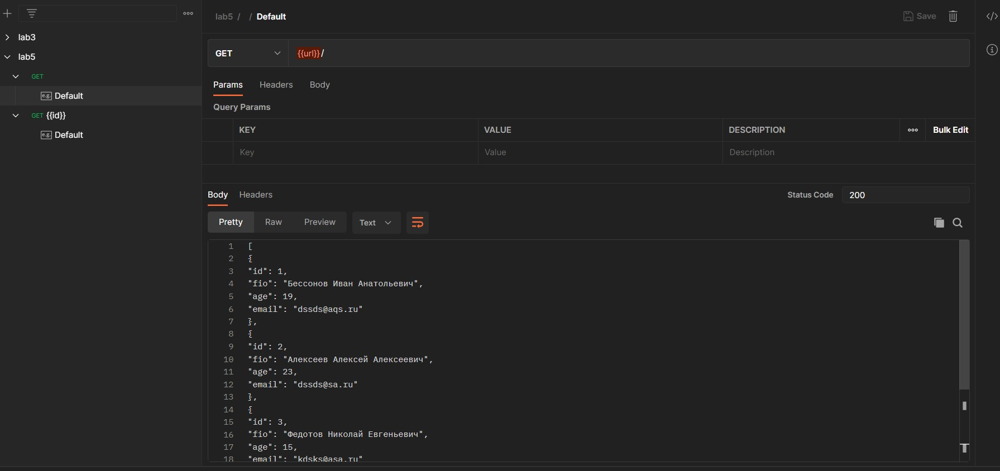
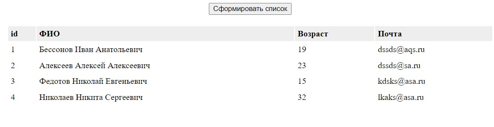
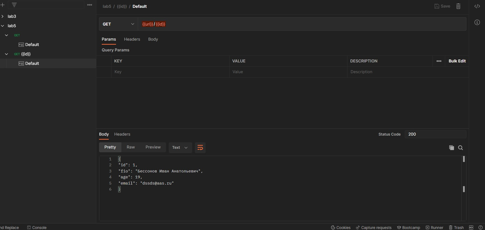
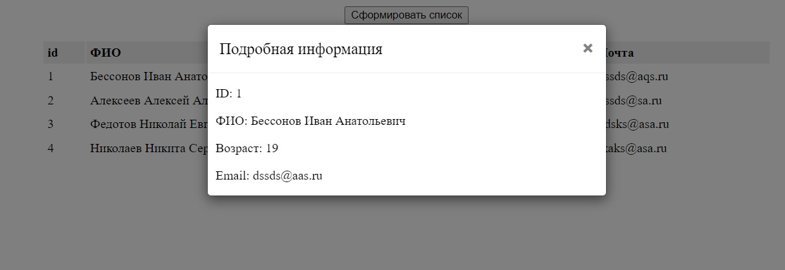

<p align = center>МИНИСТЕРСТВО НАУКИ И ВЫСШЕГО ОБРАЗОВАНИЯ

<p align = center>РОССИЙСКОЙ ФЕДЕРАЦИИ

<p align = center>ФЕДЕРАЛЬНОЕ ГОСУДАРСТВЕННОЕ БЮДЖЕТНОЕ ОБРАЗОВАТЕЛЬНОЕ УЧРЕЖДЕНИЕ ВЫСШЕГО ОБРАЗОВАНИЯ

<p align = center>«ВЯТСКИЙ ГОСУДАРСТВЕННЫЙ УНИВЕРСИТЕТ»

<p align = center>Институт математики и информационных систем

<p align = center>Факультет автоматики и вычислительной техники

<p align = center>Кафедра систем автоматизации управления
<br>
<br>
<br>
<br>

<p align = right>Дата сдачи на проверку:

<p align = right>«___» __________ 2022 г.

<p align = right>Проверено:

<p align = right>«___» __________ 2022 г.
<br>
<br>
<br>
<br>
<br>


<p align = center>Отчет по лабораторной работе № 5

<p align = center>по дисциплине

<p align = center>«Web-программирование»

<br>
<br>
<br>
<br>


<p align = center>Разработал студент гр. ИТб-2301-01-00 ________________ /Бессонов И.А./

<p align = center>Проверил ст. преподаватель _________________ /Земцов М.А./

<p align = center>Работа защищена с оценкой «___________» «___» __________ 2022 г.

<br>
<br>
<br>
<br>

<p align = center>Киров 2022

<hr>
Цель:  провести тестирование отправки axios-запроса на mock-сервер

Задачи:

1. Организовать процесс работы над лабораторной работой
1. Отправить get запрос на mock-сервер и получить ответ в виде таблицы
1. По нажатию на строку таблицы выводить информацию в модальное окно


Ход выполнения:

1. Организовать процесс работы над лабораторной работой

Для работы в репозитории *[ссылка на репозиторий](https://github.com/Virus567/Web)* на сайте github.com была создана новая ветвь с названием lab5 от ветки pr2.

2. Отправить get запрос на mock-сервер и получить ответ в виде таблицы

В ходе лабораторной работы был создан новый mock-сервер в Postman. Для вывода информации в таблицу был написан Get-запрос, представленный на рисунке 1. Полученный ответ сервера передается в список. С помощью списка заполняется таблица, которая изображена на рисунке 2. Листинг компонента table  приведен в приложении А.

<p align=center></p>

<p align = center>Рисунок 1 – Get-запрос

<p align=center></p>

<p align = center>Рисунок 2 – Полученная таблица

3.  По нажатию на строку таблицы выводить информацию в модальное окно

Для реализации этой задачи в компонент table было добавлено модальное окно. В Postman создан новый Get-запрос. Тело запроса представлено на рисунке 3, а результат его работы представлен на рисунке 4.


<p align=center></p>

<p align = center>Рисунок 3 – Get-запрос

<p align=center></p>

<p align = center>Рисунок 4 – Модальное окно


Вывод: в ходе выполнения лабораторной работы были получены данные с mock-сервера и организовано взаимодействие пользователя с ними. Данные отображены в таблицу, при нажатии на строку таблицы открывается модальное окно с полной информацией.

<p align = center>Приложение А

<p align = center>(обязательное) 

<p align = center>Листинг компонента table.vue

```html
<template>
<div class="container">
  <button type="button" v-on:click="GetList">Сформировать список</button>
  <loader v-if="loading"/>
  <table v-else class="table_block">
    <tr><th>id</th><th>ФИО</th><th>Возраст</th><th>Почта</th></tr>
    <tr v-on:click="FindById(item.id)" v-for="(item) in list" :key="item.id">
      <td>{{ item.id }}</td>
      <td>{{ item.fio }}</td>
      <td>{{ item.age }}</td>
      <td>{{ item.email }}</td>
    </tr>
  </table>
  <div id="openModal" class="modal">
  <div class="modal-dialog">
    <div class="modal-content">
      <div class="modal-header">
        <h3 class="modal-title">Подробная информация</h3>
        <a v-on:click="CloseModal" class="close">×</a>
      </div>
      <div class="modal-body">
        <p>ID: {{element.id}}</p>
        <p>ФИО: {{element.fio}}</p>
        <p>Возраст: {{element.age}}</p>
        <p>Email: {{element.email}}</p>
      </div>
    </div>
  </div>
</div>
</div>
</template>

<script lang="ts">
import axios from 'axios';
export default {
  data: () => ({
    loading: true,
    list: [],
    element: {},
  }),
  methods: {
    GetList() {
      const config = {
        url: 'https://80b603bf-d22f-4c72-9130-52004b6307c5.mock.pstmn.io',
      };
      axios.get(config.url)
        .then((response) => {
          console.log(response.data);
          this.list = response.data;
          this.loading = false;
        })
        .catch((error) => {
          console.log(error);
        });
    },
    FindById(i) {
      const config = {
        url: 'https://80b603bf-d22f-4c72-9130-52004b6307c5.mock.pstmn.io/',
      };
      axios.get(config.url + i)
        .then((response) => {
          console.log(response.data);
          this.element = response.data;
          const modal :HTMLDivElement = document.querySelector('#openModal');
          modal.style.opacity = '1';
          modal.style.pointerEvents = 'auto';
          modal.style.overflowY = 'auto';
        })
        .catch((error) => {
          console.log(error);
        });
    },
    CloseModal() {
      const modal :HTMLDivElement = document.querySelector('#openModal');
      modal.style.opacity = '0';
      modal.style.pointerEvents = 'none';
    },
  },
};
</script>
<style scoped>
  .container{
    width: 100%;
    margin: 0 auto;
    display: block;
    margin: 0 auto;
    text-align: center;
  }
  .table_block {
margin: 20px auto;
width: 60%;
}
.table_block tr {
    cursor: pointer;
}
.table_block th,
.table_block td {
padding: 5px;
text-align: left;
}
.table_block tr:hover:not(:first-child),
.table_block th {
background-color: #EEEEEE;
transition: all 0.5s;
}
.modal {
    position: fixed;
    top: 0;
    right: 0;
    bottom: 0;
    left: 0;
    background: rgba(0,0,0,0.5);
    z-index: 1050;
    opacity: 0;
    -webkit-transition: opacity 200ms ease-in;
    -moz-transition: opacity 200ms ease-in;
    transition: opacity 200ms ease-in;
    pointer-events: none;
    margin: 0;
    padding: 0;
}
.modal:target {
    opacity: 1;
    pointer-events: auto;
    overflow-y: auto;
}
.modal-dialog {
    position: relative;
    width: auto;
    margin: 10px;
}
@media (min-width: 576px) {
  .modal-dialog {
      max-width: 500px;
      margin: 30px auto;
  }
}
.modal-content {
    position: relative;
    display: -webkit-box;
    display: -webkit-flex;
    display: -ms-flexbox;
    display: flex;
    -webkit-box-orient: vertical;
    -webkit-box-direction: normal;
    -webkit-flex-direction: column;
    -ms-flex-direction: column;
    flex-direction: column;
    background-color: #fff;
    -webkit-background-clip: padding-box;
    background-clip: padding-box;
    border: 1px solid rgba(0,0,0,.2);
    border-radius: .3rem;
    outline: 0;
}
@media (min-width: 768px) {
  .modal-content {
      -webkit-box-shadow: 0 5px 15px rgba(0,0,0,.5);
      box-shadow: 0 5px 15px rgba(0,0,0,.5);
  }
}
.modal-header {
    display: -webkit-box;
    display: -webkit-flex;
    display: -ms-flexbox;
    display: flex;
    -webkit-box-align: center;
    -webkit-align-items: center;
    -ms-flex-align: center;
    align-items: center;
    -webkit-box-pack: justify;
    -webkit-justify-content: space-between;
    -ms-flex-pack: justify;
    justify-content: space-between;
    padding: 15px;
    border-bottom: 1px solid #eceeef;
}
.modal-title {
    margin-top: 0;
    margin-bottom: 0;
    line-height: 1.5;
    font-size: 1.25rem;
    font-weight: 500;
}
.close {
    float: right;
    font-family: sans-serif;
    font-size: 24px;
    font-weight: 700;
    line-height: 1;
    color: #000;
    text-shadow: 0 1px 0 #fff;
    opacity: .5;
    text-decoration: none;
}
.close:focus, .close:hover {
    color: #000;
    text-decoration: none;
    cursor: pointer;
    opacity: .75;
}
.modal-body {
  margin-left: 10px;
  text-align: left;
}
</style>
```