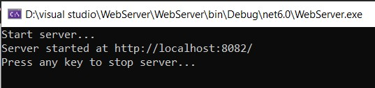
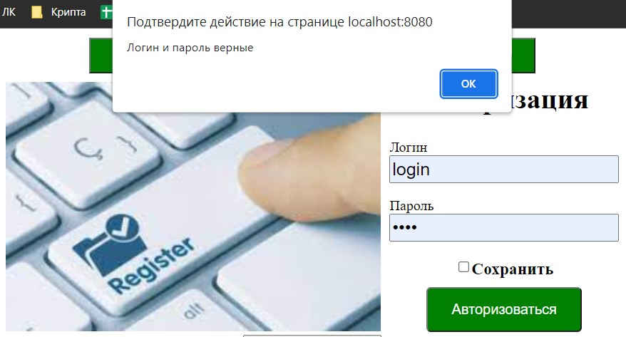
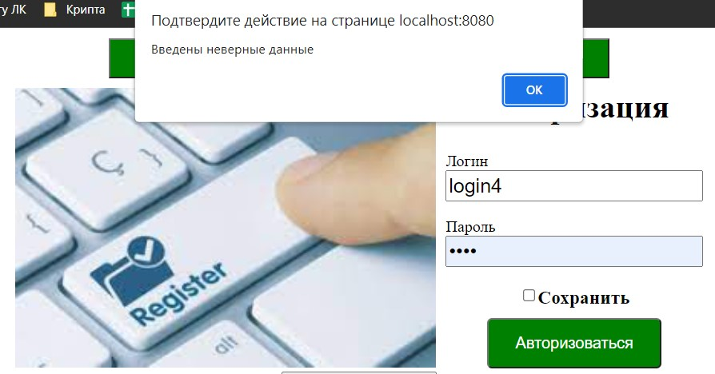
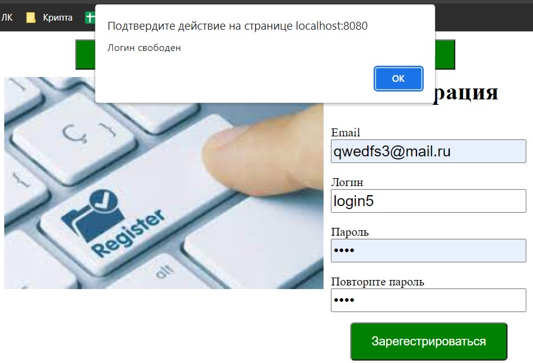
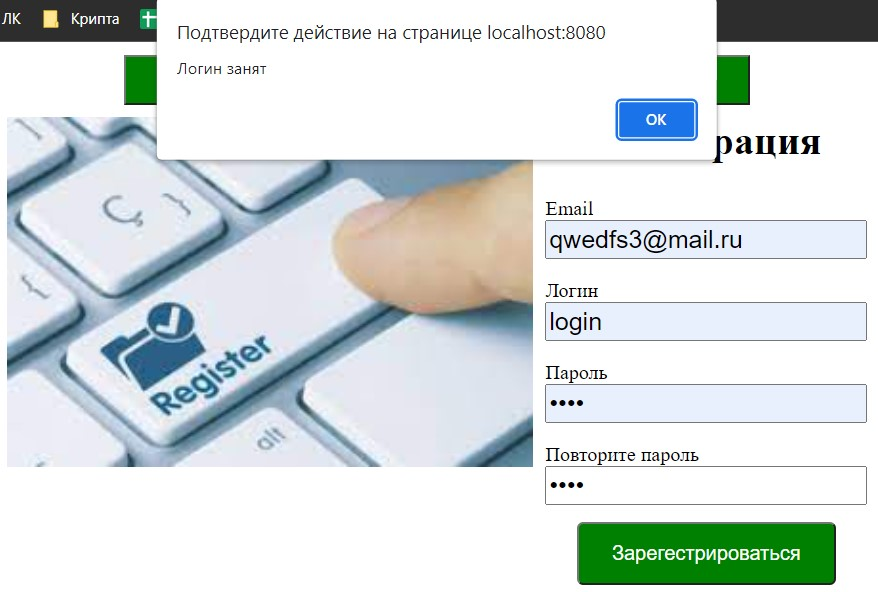
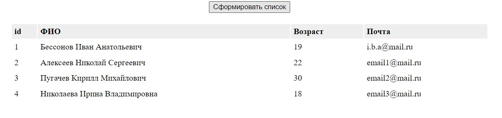
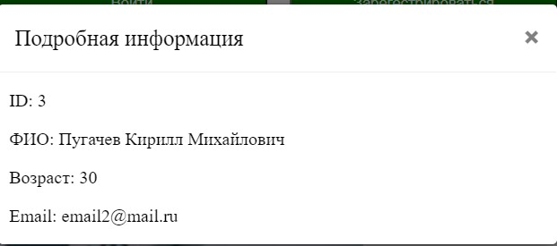

<p align = center>МИНИСТЕРСТВО НАУКИ И ВЫСШЕГО ОБРАЗОВАНИЯ

<p align = center>РОССИЙСКОЙ ФЕДЕРАЦИИ

<p align = center>ФЕДЕРАЛЬНОЕ ГОСУДАРСТВЕННОЕ БЮДЖЕТНОЕ ОБРАЗОВАТЕЛЬНОЕ УЧРЕЖДЕНИЕ ВЫСШЕГО ОБРАЗОВАНИЯ

<p align = center>«ВЯТСКИЙ ГОСУДАРСТВЕННЫЙ УНИВЕРСИТЕТ»

<p align = center>Институт математики и информационных систем

<p align = center>Факультет автоматики и вычислительной техники

<p align = center>Кафедра систем автоматизации управления
<br>
<br>
<br>
<br>

<p align = right>Дата сдачи на проверку:

<p align = right>«___» __________ 2022 г.

<p align = right>Проверено:

<p align = right>«___» __________ 2022 г.
<br>
<br>
<br>
<br>
<br>


<p align = center>Отчет по лабораторной работе № 7

<p align = center>по дисциплине

<p align = center>«Web-программирование»

<br>
<br>
<br>
<br>


<p align = center>Разработал студент гр. ИТб-2301-01-00 ________________ /Бессонов И.А./

<p align = center>Проверил ст. преподаватель _________________ /Земцов М.А./

<p align = center>Работа защищена с оценкой «___________» «___» __________ 2022 г.

<br>
<br>
<br>
<br>

<p align = center>Киров 2022

<hr>
Цель:  реализовать web-сервер на целевом языке программирования (C#)

Задачи:

1. Организовать процесс работы над лабораторной работой
1. Создать web-сервер на языке программирования C# без использования ASP.NET core.
1. Реализовать задание на третью и пятую лабораторные работы с использованием собственного сервера.
    - Реализовать проверку логина и пароля при авторизации.
    - Реализовать проверку уникальности логина при регистрации.
    - Реализовать вывод информации о студентах в таблицу.
    - Реализовать вывод информации о конкретном студенте.


Ход выполнения:

1. Организовать процесс работы над лабораторной работой

Для работы в репозитории *[ссылка на репозиторий](https://github.com/Virus567/Web)* на сайте github.com была создана новая ветвь с названием lab7 от ветки lab5.

2. Создать web-сервер на языке программирования C# без использования ASP.NET core.

В ходе лабораторной работы было создано консольное приложение. Через NuGet пакеты добавлена библиотека RestPanda, основання на базе библиотеки HTTP.sys. Для выполнения запросов были созданы два класса-сущности: User и Student. Листинг этих классов представлен в приложении А. В классе Program был реализован старт и остановка сервера, листинг этого класса представлен в приложении Б. Демонтсрация работы сервера представлена на рисунке 1.

<p align=center></p>
<p align = center>Рисунок 1 – web-сервер


3. Реализовать задание на третью и пятую лабораторные работы с использованием собственного сервера.

Для реализации соответствующих запросов были созданы два класса: HandlerAuth и HandlerGetStudent. Листинг классов представлен в приложении В. Были созданы два Post-запроса для реализации задания на 3 лабараторную работу и один Get-запрос для реализации задания на 5 лабораторную работу, также была частично изменена структура компонентов из 3 и 5 лабораторных работ. полученные результаты отражены на рисунках 2-7.


<p align=center></p>
<p align = center>Рисунок 2 – Успешная авторизация

<p align=center></p>
<p align = center>Рисунок 3 – Неуспешная авторизация

<p align=center></p>
<p align = center>Рисунок 4 – Уникальный логин

<p align=center></p>
<p align = center>Рисунок 5 – Неуникальный логин

<p align=center></p>
<p align = center>Рисунок 6 – Таблица студентов

<p align=center></p>
<p align = center>Рисунок 7 – Подробная информация о студенте

Вывод: в ходе выполнения лабораторной работы были получены данные с собственного web-сервера и организовано взаимодействие пользователя с ними. 

<p align = center>Приложение А

<p align = center>(обязательное) 

<p align = center>Листинг классов User и Student

```C#
namespace WebServer.Entity
{
    public class Student
    {
        public int id { get; set; }
        public string fio { get; set; }
        public int age { get; set; }
        public string email { get; set; }

        public Student()
        {
        }

        public Student(int id, string lastName, string firstName, string middleName, int age, string email)
        {
            this.id = id;
            this.fio = lastName + " " + firstName + " " + middleName;
            this.age = age;
            this.email = email;
        }

        public static List<Student> Students { get; } = new(new[]
    {
        new Student(1, "Бессонов", "Иван", "Анатольевич", 19, "i.b.a@mail.ru"),
        new Student(2, "Алексеев", "Николай", "Сергеевич", 22, "email1@mail.ru"),
        new Student(3, "Пугачев", "Кирилл", "Михайлович", 30, "email2@mail.ru"),
        new Student(4, "Николаева", "Ирина", "Владимировна", 18, "email3@mail.ru")
    });
        
        public static Student? GetByID(dynamic id)
        {
            return Students.FirstOrDefault(stud => stud.id == id);
        }

        public static string Serialize(Student stud)
        {
            return JsonSerializer.Serialize(stud);
        }
    
    }
}


namespace WebServer.Entity;

public class User
{
    public string login { get; set; }
    public string pass { get; set; }

    public static List<User> Users = new List<User>() 
    { 
        new User() { login = "login", pass = "pass" },
        new User() { login = "login1", pass = "pass1" },
        new User() { login = "login2", pass = "pass2" },
    };
    
}


```

<p align = center>Приложение Б

<p align = center>(обязательное) 

<p align = center>Листинг класса Program

```C#
namespace WebServer;

public class Program
{
    private static List<DateTime> _times = new();

    public static int GetTimes()
    {
        _times.Add(DateTime.Now);
        foreach (var time in _times.Where(time => (time - _times[^1]).Minutes >= 1))
        {
            _times.Remove(time);
        }
        return _times.Count;
    }

    public static void Main(string[] args)
    {
        var url = "http://localhost:8082/";
        Console.WriteLine("Start server...");
        var server = new PandaServer(url, typeof(Program));
        server.Start();
        Console.WriteLine("Server started at " + url);
        Console.WriteLine("Press any key to stop server...");
        Console.Read();
        server.Stop();
    }
}

```

<p align = center>Приложение В

<p align = center>(обязательное) 

<p align = center>Листинг классов HandlerAuth и HandlerGetStudent

```C#
namespace WebServer.Requests;

[RequestHandler("/auth")]
public class HandlerAuth
{
    [Post("check")]
    public static void Check(PandaRequest request, PandaResponse response)
    {
        var user = request.GetObject<User>();
        response.AddHeader("Time", DateTime.Now.ToString("O"));
        response.AddHeader("Token", Guid.NewGuid().ToString());
        response.AddHeader("Request-Per-Minutes", Program.GetTimes().ToString());

        foreach (var u in User.Users)
        {
            if (user.login == u.login)
            {
                response.Send(new { IsValid = false });
                return;
            } 
        }
        response.Send(new { IsValid = true });


    }

    [Post("login")]
    public static void Login(PandaRequest request, PandaResponse response)
    {
        var user = request.GetObject<User>();
        response.AddHeader("Time", DateTime.Now.ToString("O"));
        response.AddHeader("Token", Guid.NewGuid().ToString());
        response.AddHeader("Request-Per-Minutes", Program.GetTimes().ToString());

        foreach (var u in User.Users)
        {
            if (user.login == u.login && user.pass == u.pass)
            {
                response.Send(new { completed = true });
                return;
            }           
        }        
        response.Send(new { completed = false });

    }
}


namespace WebServer.Requests;

[RequestHandler("/getstudent")]
public class HandlerGetStudent
{
    [Get]
    public static void GetStuds(PandaRequest request, PandaResponse response)
    {
        response.AddHeader("Time", DateTime.Now.ToString("O"));
        response.AddHeader("Token", Guid.NewGuid().ToString());
        response.AddHeader("Request-Per-Minutes", Program.GetTimes().ToString());
        if (!request.Params.ContainsKey("id"))
        {
            response.Send(Student.Students);
            return;
        }
        var f = request.Params["id"];
        int start;
        if (!int.TryParse(f, out start))
        {
            response.Send("Error");
            return;
        }
        if (Student.Students.All(s => s.id != start))
        {
            response.Send("Error");
            return;
        }
        response.Send(Student.Students.Single(s => s.id == start));
    }
}

```