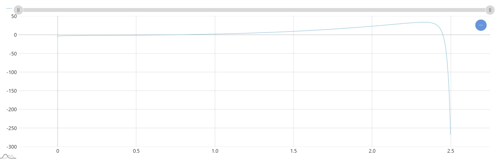

<p align = center>МИНИСТЕРСТВО НАУКИ И ВЫСШЕГО ОБРАЗОВАНИЯ

<p align = center>РОССИЙСКОЙ ФЕДЕРАЦИИ

<p align = center>ФЕДЕРАЛЬНОЕ ГОСУДАРСТВЕННОЕ БЮДЖЕТНОЕ ОБРАЗОВАТЕЛЬНОЕ УЧРЕЖДЕНИЕ ВЫСШЕГО ОБРАЗОВАНИЯ

<p align = center>«ВЯТСКИЙ ГОСУДАРСТВЕННЫЙ УНИВЕРСИТЕТ»

<p align = center>Институт математики и информационных систем

<p align = center>Факультет автоматики и вычислительной техники

<p align = center>Кафедра систем автоматизации управления
<br>
<br>
<br>
<br>

<p align = right>Дата сдачи на проверку:

<p align = right>«___» __________ 2022 г.

<p align = right>Проверено:

<p align = right>«___» __________ 2022 г.
<br>
<br>
<br>
<br>
<br>


<p align = center>Отчет по лабораторной работе № 8

<p align = center>Вариант 1.

<p align = center>по дисциплине

<p align = center>«Web-программирование»

<br>
<br>
<br>
<br>


<p align = center>Разработал студент гр. ИТб-2301-01-00 ________________ /Бессонов И.А./

<p align = center>Проверил ст. преподаватель _________________ /Земцов М.А./

<p align = center>Работа защищена с оценкой «___________» «___» __________ 2022 г.

<br>
<br>
<br>
<br>

<p align = center>Киров 2022

<hr>
Цель: реализовать React-компонент вывода графика математической функции.

Задачи:

1. Организовать процесс работы над лабораторной работой
1. Реализовать компонент вывода графика математической функции (y = 3 * x^3 - 2^(e^(x^3 - 2 * x^2 - 1)) + log13(x)) средствами amcharts5.


Ход выполнения:

1. Организовать процесс работы над лабораторной работой

Для работы в репозитории *[ссылка на репозиторий](https://github.com/Virus567/Web)* на сайте github.com была создана новая ветвь с названием lab8 от ветки main.

2. Реализовать компонент вывода графика математической функции (y = 3 * x^3 - 2^(e^(x^3 - 2 * x^2 - 1)) + log13(x)) средствами amcharts5.

В ходе лабораторной работы было создано новое React-приложение. Была установлена библиотека amcharts5 для визуализации данных, в частности для отображения графиков функций. Также реализован React-компонент Graph.tsx, отображающий график функции y = 3 * x^3 - 2^(e^(x^3 - 2 * x^2 - 1). Листинг компонента представлен в приложении А.
Результат работы представлен на рисунке 1. 

<p align=center></p>
<p align = center>Рисунок 1 – График функции


Вывод: в ходе выполнения лабораторной работы были получены навыки работы с библиотекой для вывода графиков и реализован компонент для вывода графика математической функции. 

<p align = center>Приложение А

<p align = center>(обязательное) 

<p align = center>Листинг компонента Graph.tsx

```TS
import React from 'react';
import * as am5 from "@amcharts/amcharts5";
import * as am5xy from "@amcharts/amcharts5/xy";
import am5themes_Animated from "@amcharts/amcharts5/themes/Animated";

export declare type GraphProps = {
	min: number,
	max: number,
	delta: number
}

type Point = {
	x: number,
	y: number
}

class Graph extends React.Component<GraphProps> {
  funcMath() {
		let points: Point[] = [];
		let y: number;
		for (let x = this.props.min; x < this.props.max; x += this.props.delta) {
			y = 3 * (x ** 3) - 2 ** (Math.E ** (x ** 3 - 2 * (x ** 2) - 1)) + (Math.log(x) / Math.log(13));
			points.push({x: x, y: y});
		}
		return points;
	};


  componentDidMount() {
		const root = am5.Root.new("main");

		root.setThemes([
			am5themes_Animated.new(root)
		]);

		let data = this.funcMath();

		let chart = root.container.children.push(
			am5xy.XYChart.new(root, {
				focusable: true,
				panX: true,
				panY: true,
				wheelX: "panX",
				wheelY: "zoomX"
			})
		);

		let xAxis = chart.xAxes.push(
			am5xy.ValueAxis.new(root, {
					min: this.props.min,
					max: this.props.max,
					renderer: am5xy.AxisRendererX.new(root, {})
				}
			)
		);

		let yAxis = chart.yAxes.push(
			am5xy.ValueAxis.new(root, {
				maxDeviation: 0.1,
				renderer: am5xy.AxisRendererY.new(root, {})
			})
		);

		let series = chart.series.push(
			am5xy.LineSeries.new(root, {
				xAxis: xAxis,
				yAxis: yAxis,
				valueYField: "y",
				valueXField: "x",
				tooltip: am5.Tooltip.new(root, {
					pointerOrientation: "horizontal",
					labelText: "{valueY}"
				})
			})
		);
		series.data.setAll(data);

		let legend = chart.children.push(am5.Legend.new(root, {}));
		legend.data.setAll(chart.series.values);

		let cursor = chart.set("cursor", am5xy.XYCursor.new(root, {
			xAxis: xAxis
		}));
		cursor.lineY.set("visible", false);

		chart.set("scrollbarX", am5.Scrollbar.new(root, {
			orientation: "horizontal"
		}));
	}

	render() {
		return <div>
			<div id="main" style={{ width: "100%", height: "500px" }}/>
		</div>;
  };

}
  
  export default Graph;

```