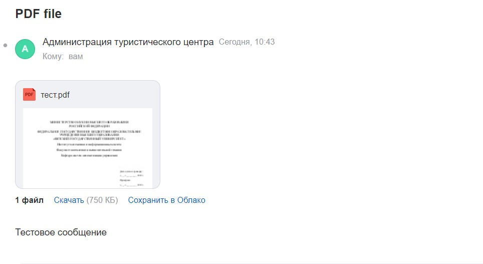
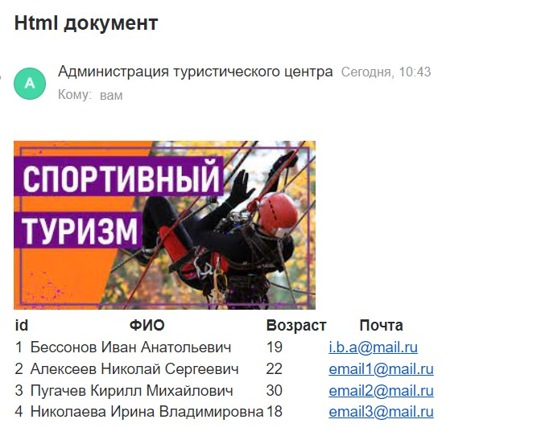

<p align = center>МИНИСТЕРСТВО НАУКИ И ВЫСШЕГО ОБРАЗОВАНИЯ

<p align = center>РОССИЙСКОЙ ФЕДЕРАЦИИ

<p align = center>ФЕДЕРАЛЬНОЕ ГОСУДАРСТВЕННОЕ БЮДЖЕТНОЕ ОБРАЗОВАТЕЛЬНОЕ УЧРЕЖДЕНИЕ ВЫСШЕГО ОБРАЗОВАНИЯ

<p align = center>«ВЯТСКИЙ ГОСУДАРСТВЕННЫЙ УНИВЕРСИТЕТ»

<p align = center>Институт математики и информационных систем

<p align = center>Факультет автоматики и вычислительной техники

<p align = center>Кафедра систем автоматизации управления
<br>
<br>
<br>
<br>

<p align = right>Дата сдачи на проверку:

<p align = right>«___» __________ 2022 г.

<p align = right>Проверено:

<p align = right>«___» __________ 2022 г.
<br>
<br>
<br>
<br>
<br>


<p align = center>Отчет по лабораторной работе № 8

<p align = center>по дисциплине

<p align = center>«Web-программирование»

<br>
<br>
<br>
<br>


<p align = center>Разработал студент гр. ИТб-2301-01-00 ________________ /Бессонов И.А./

<p align = center>Проверил ст. преподаватель _________________ /Земцов М.А./

<p align = center>Работа защищена с оценкой «___________» «___» __________ 2022 г.

<br>
<br>
<br>
<br>

<p align = center>Киров 2022

<hr>
Цель: реализовать отправку электронного письма условному пользователю от имени веб-приложения на целевом языке программирования.

Задачи:

1. Организовать процесс работы над лабораторной работой
1. Реализовать отправку электронного письма условному пользователю
    - Отправка текстового сообщения
    - Отправка тесктового сообщения с pdf документом
    - Отправка HTML-разметки, содержащей картинку и таблицу


Ход выполнения:

1. Организовать процесс работы над лабораторной работой

Для работы в репозитории *[ссылка на репозиторий](https://github.com/Virus567/Web)* на сайте github.com была создана новая ветвь с названием lab9 от ветки main.

2. Реализовать отправку электронного письма условному пользователю.

В ходе лабораторной работы был создан класс HandlerEmail. С помощью встроенной библиотеки SmtpClient реализован метод отправления электронного письма с текстовым сообщением и pdf-документом и отправления электронного сообщения, содержащего HTML-разметку. Результат работы метода представлен на рисунках 1 и 2. Листинг класса представлен в приложении А.

<p align=center></p>
<p align = center>Рисунок 1 – Письмо, содержащее вложенный файл и текст

<p align=center></p>
<p align = center>Рисунок 2 – Письмо, содержащее HTML-разметку


Вывод: в ходе выполнения лабораторной работы были получены навыки работы со встроенной библиотекой для рассылки электронных писем SmtpClient. 

<p align = center>Приложение А

<p align = center>(обязательное) 

<p align = center>Листинг класса HandlerEmail.cs

```C#
using System;
using System.Collections.Generic;
using System.Linq;
using System.Text;
using System.Threading.Tasks;
using System.Net.Mail;
using RestPanda.Requests.Attributes;
using RestPanda.Requests;
using WebServer.Entity;
using System.Net;

namespace WebServer.Requests
{
    [RequestHandler]
    public class HandlerEmail
    {
        private static string FillTable()
        {
            var s = new StringBuilder("<table style=\"border-collapse: collapse\">" + Environment.NewLine);
            s.Append("<tr><th>id</th><th>ФИО</th><th>Возраст</th><th>Почта</th></tr>" + Environment.NewLine);
            foreach (var student in Student.Students)
            {
                s.Append("<tr>").Append($"<td>{student.id}</td>").Append($"<td>{student.fio}</td>")
                    .Append($"<td>{student.age}</td>").Append($"<td>{student.email}</td>").Append("</tr>" + Environment.NewLine);
            }

            s.Append("</table>");
            return s.ToString();
        }

        [Get]
        public static void CommitMessange(PandaRequest request, PandaResponse response)
        {
            var from = new MailAddress("tourist-center-vyatsu@mail.ru", "Администрация туристического центра");
            var to = new MailAddress("i.b.a1@mail.ru", "Пользователь");
            var msg = new MailMessage(from, to);
            msg.Subject = "PDF file";
            msg.Attachments.Add(
                new Attachment("C://Users/admin/Desktop/тест.pdf"));
            msg.Body = "Тестовое сообщение";
            using (var smtp = new SmtpClient("smtp.mail.ru", 587))
            {
                smtp.Credentials = new NetworkCredential("tourist-center-vyatsu@mail.ru", "pass");
                smtp.EnableSsl = true;
                smtp.Send(msg);
            }

            var msg2 = new MailMessage(from, to);
            msg2.Subject = "Html документ";
            msg2.Body = "" + Environment.NewLine;
            msg2.Body += FillTable();
            msg2.IsBodyHtml = true;
            using (var smtp = new SmtpClient("smtp.mail.ru", 587))
            {
                smtp.Credentials = new NetworkCredential("tourist-center-vyatsu@mail.ru", "pass");
                smtp.EnableSsl = true;
                smtp.Send(msg2);
            }

            response.Send("");
        }
    }
}

```